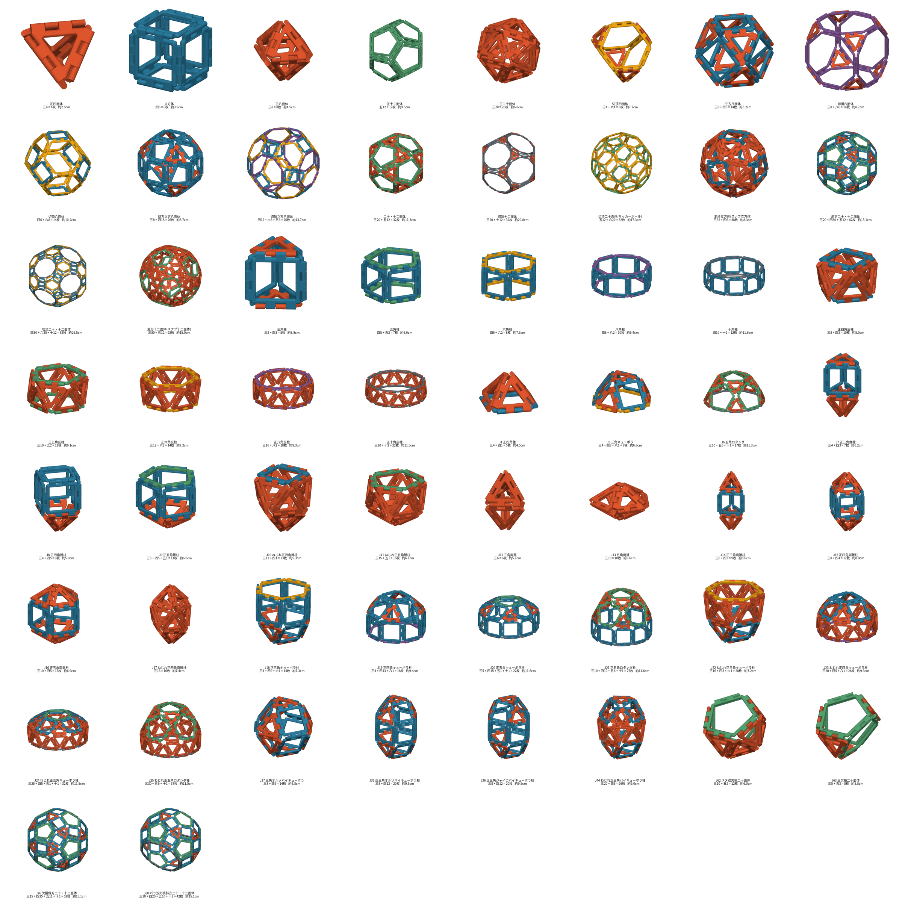

# GeoFrame

正多角形の枠をつなぎ、平面図形や多面体を組む知育玩具。

## ファイル

| ファイル | 内容 |
|---|---|
| geoframe.poly | 本体。`-D sides=3`(3・4・5・6・8・10)で角数を切り替える |
| triangle / square / pentagon / hexagon / octagon / decagon.stl | 各角数のタイル |

`make` で6種を出力する。

| 項目 | 値 |
|---|---|
| 辺長(ヒンジ軸間) | 35 mm |
| 厚み = ナックル直径 | 3 mm |
| 枠の幅 | 3 mm |
| ヒンジ軸〜枠外周 | 2.2 mm |
| ナックル間すきま | 0.2 mm |
| ピン(半球)の半径 = 突き出し / 受け穴深さ | 1.0 / 0.85 mm(はまり込み 0.8 mm) |
| 四角の枠外形 | 30.6 mm 角(ナックル込み 38 mm) |
| 八角 / 十角の差し渡し | 87.5 / 113 mm(ナックル込み) |

組み上げた多面体はタイルの厚み中心面が面になり、辺長は `edge` に一致する。

## 嵌め合わせの検証

2枚を組んだ状態を作り、`inter` の体積(干渉量)で確認した。

| 組み合わせ | 折り角 | 用途 | 干渉 |
|---|---|---|---|
| 同士・平置き | 0° | 平面図形 | 0 |
| 三角・三角 | 70.5° / 109.5° | 正八面体 / 正四面体 | 0 |
| 四角・四角 | 90° / 120° | 立方体 / 三角柱 | 0 |
| 三角・四角 | 90° | 三角柱 | 0 |
| 三角・四角 | 125.3° | 四角錐 | 0.16 mm³(接する程度) |
| 五角・五角 | 63.4° | 正十二面体 | 0 |
| 六角・六角 | 41.8° / 70.5° | サッカーボール / 切頂八面体 | 0 |
| 五角・六角 | 37.4° | サッカーボール(切頂二十面体) | 0 |
| 四角・五角 / 四角・六角 | 90° | 五角柱 / 六角柱 | 0 |
| 四角・六角 | 125.3° | 切頂八面体 | 0.13 mm³(接する程度) |
| 三角・六角 | 109.5° | 切頂四面体 | 0 |
| 三角・五角 | 142.6° | **五角錐 — 組めない** | 36.9 mm³ |

八角形・十角形を含む組み合わせは、2枚組ではなく組み上げた状態の全体検査(下の check_assembly.py)で
確かめた。四角・八角 135°(J4)と四角・十角 148.3° / 三角・十角 142.6°(J5)は組めない

五角錐は面のなす角が 37.4° と鋭く、厚さ 3mm の板どうしがヒンジ軸から約 4.4mm の
範囲でぶつかる。`axis_gap` を 4.5mm 程度まで広げれば理屈上は通るが、ほかの組み方の
すき間が大きくなるので対象外とした

- ピンは相手の受け穴に 0.8mm 入り、先端に 0.05mm 余る
- 軸方向のガタは `gap` + 0.05mm = 0.25mm(平置きで相手を軸方向にずらし、干渉が出るまでを測定)。
  1辺の2本のピンはどちらも「相手を押し込む向き」に効くので、押し込む側は穴の底まで 0.05mm、
  引き抜く側は真ん中のナックル端面どうしが当たるまで `gap` 動く。`gap` 0.4mm のときは 0.45mm あった
- `margin`(辺の両端でナックルを置かない長さ)が 4mm だと、三角形の鋭角で
  相手の隣の辺のナックルと当たった(109.5° で 0.28mm³)。5mm で解消

## 組める立体と部品数

正三角形(三)・正方形(四)・正五角形(五)・正六角形(六)・正八角形(八)・正十角形(十)だけでできる凸多面体について、
座標から二面角を計算し、出てくる「角数の組 × 折り角」をすべて2枚組の干渉テストにかけた。
組めないのは五角錐(三・五 142.6°)、四角キューポラ、五角キューポラの3つで、ほかは干渉 0(四角錐・立方八面体などの
三・四 / 四・六 125.3° のみ 0.1mm³ 程度接する)。二面角は poly_list.py(座標 → 凸包 → 二面角、
`uv run --with scipy --with numpy python poly_list.py`)で計算した。

### 正多面体

| 立体 | 三 | 四 | 五 | 六 | 計 |
|---|---|---|---|---|---|
| 正四面体 | 4 | | | | 4 |
| 立方体 | | 6 | | | 6 |
| 正八面体 | 8 | | | | 8 |
| 正十二面体 | | | 12 | | 12 |
| 正二十面体 | 20 | | | | 20 |

### アルキメデスの立体

| 立体 | 三 | 四 | 五 | 六 | 計 |
|---|---|---|---|---|---|
| 切頂四面体 | 4 | | | 4 | 8 |
| 立方八面体 | 8 | 6 | | | 14 |
| 切頂八面体 | | 6 | | 8 | 14 |
| 斜方立方八面体 | 8 | 18 | | | 26 |
| 二十・十二面体 | 20 | | 12 | | 32 |
| 切頂二十面体(サッカーボール) | | | 12 | 20 | 32 |
| 変形立方体(スナブ立方体) | 32 | 6 | | | 38 |
| 斜方二十・十二面体 | 20 | 30 | 12 | | 62 |
| 変形十二面体(スナブ十二面体) | 80 | | 12 | | 92 |

八角形・十角形を含む残りの4種(切頂六面体など)は下の「八角形・十角形を使う立体」にある。
これでアルキメデスの立体13種がすべて組める。

### 角柱・反角柱

| 立体 | 三 | 四 | 五 | 六 | 計 |
|---|---|---|---|---|---|
| 三角柱 | 2 | 3 | | | 5 |
| 五角柱 | | 5 | 2 | | 7 |
| 六角柱 | | 6 | | 2 | 8 |
| 正四角反柱 | 8 | 2 | | | 10 |
| 正五角反柱 | 10 | | 2 | | 12 |
| 正六角反柱 | 12 | | | 2 | 14 |

### ジョンソンの立体(計算したもの)

| 立体 | 三 | 四 | 五 | 六 | 計 |
|---|---|---|---|---|---|
| J1 正四角錐 | 4 | 1 | | | 5 |
| J12 三角両錐 | 6 | | | | 6 |
| J7 正三角錐柱(三角柱+四面体) | 4 | 3 | | | 7 |
| J3 三角キューポラ | 4 | 3 | | 1 | 8 |
| J63 三欠損二十面体 | 5 | | 3 | | 8 |
| J8 正四角錐柱(立方体+四角錐) | 4 | 5 | | | 9 |
| J14 正三角両錐柱 | 6 | 3 | | | 9 |
| J13 五角両錐 | 10 | | | | 10 |
| J9 正五角錐柱(五角柱+五角錐) | 5 | 5 | 1 | | 11 |
| J15 正四角両錐柱 | 8 | 4 | | | 12 |
| J62 メタ双欠損二十面体 | 10 | | 2 | | 12 |
| J10 ねじれ正四角錐柱(四角反柱+四角錐) | 12 | 1 | | | 13 |
| J18 正三角キューポラ柱 | 4 | 9 | | 1 | 14 |
| J27 三角オルソバイキューポラ | 8 | 6 | | | 14 |
| J16 正五角両錐柱 | 10 | 5 | | | 15 |
| J11 ねじれ正五角錐柱(二十面体の頂点1つ欠け) | 15 | | 1 | | 16 |
| J17 ねじれ正四角両錐柱 | 16 | | | | 16 |
| J22 ねじれ正三角キューポラ柱 | 16 | 3 | | 1 | 20 |
| J35 正三角オルソバイキューポラ柱 | 8 | 12 | | | 20 |
| J36 正三角ジャイロバイキューポラ柱 | 8 | 12 | | | 20 |
| J44 ねじれ正三角バイキューポラ柱 | 20 | 6 | | | 26 |
| ~~J2 正五角錐~~ | 5 | | 1 | | 6 |

J2 正五角錐は三角と五角のなす角が 37.4° と鋭く、板どうしがぶつかって組めない。
ただし J9・J11・J13 のように五角錐を別の立体に載せた形は、底の五角形がないので組める。

ジョンソンの立体は全92種のうち積み重ねで座標を作れるものだけを計算した。
ほかにも部品の範囲で作れるもの(J26 ジャイロビファスティギウム、J28/J29 四角バイキューポラ、
J34 五角オルソバイロタンダ、J49〜J57 の側錐角柱、J84〜J92 など)がある。

### 八角形・十角形を使う立体

| 立体 | 三 | 四 | 五 | 六 | 八 | 十 | 計 | 大きさ |
|---|---|---|---|---|---|---|---|---|
| 切頂六面体 | 8 | | | | 6 | | 14 | 8.7 cm |
| 切頂立方八面体 | | 12 | | 8 | 6 | | 26 | 13.7 cm |
| 切頂十二面体 | 20 | | | | | 12 | 32 | 20.8 cm |
| 切頂二十・十二面体 | | 30 | | 20 | | 12 | 62 | 26.5 cm |
| 八角柱 | | 8 | | | 2 | | 10 | 9.4 cm |
| 十角柱 | | 10 | | | | 2 | 12 | 11.6 cm |
| 正八角反柱 | 16 | | | | 2 | | 18 | 9.3 cm |
| 正十角反柱 | 20 | | | | | 2 | 22 | 11.5 cm |
| J6 五角ロタンダ(二十・十二面体の半分) | 10 | | 6 | | | 1 | 17 | 11.3 cm |
| J19 正四角キューポラ柱 | 4 | 13 | | | 1 | | 18 | 9.4 cm |
| J20 正五角キューポラ柱 | 5 | 15 | 1 | | | 1 | 22 | 11.6 cm |
| J21 正五角ロタンダ柱 | 10 | 10 | 6 | | | 1 | 27 | 11.6 cm |
| J23 ねじれ正四角キューポラ柱 | 20 | 5 | | | 1 | | 26 | 9.3 cm |
| J24 ねじれ正五角キューポラ柱 | 25 | 5 | 1 | | | 1 | 32 | 11.5 cm |
| J25 ねじれ正五角ロタンダ柱 | 30 | | 6 | | | 1 | 37 | 11.5 cm |
| J80 パラ双欠損斜方二十・十二面体 | 10 | 20 | 10 | | | 2 | 42 | 15.1 cm |
| J76 欠損斜方二十・十二面体 | 15 | 25 | 11 | | | 1 | 52 | 15.1 cm |
| ~~J4 四角キューポラ~~ | 4 | 5 | | | 1 | | 10 | |
| ~~J5 五角キューポラ~~ | 5 | 5 | 1 | | | 1 | 12 | |

J4・J5 は八角形・十角形と側面のなす角が 31.7〜54.7° と鋭く、正五角錐と同じく板どうしがぶつかる
(干渉 最大 14.6 / 67.6 mm³)。下に角柱か反角柱をつけた J19・J20・J23・J24 は、鋭い角がなくなるので組める。
五角ロタンダ J6 は十角形と五角形が 63.4° で接するが、干渉 0 だった。

ほかにも、切頂六面体に四角キューポラを足した J66・J67、切頂十二面体に五角キューポラを足した J68〜J71、
斜方二十・十二面体のねじれ形・欠損形(J77〜J79、J81〜J83)が部品の範囲で作れる(未計算)。

### 組み上がり画像と全体の干渉検査

`assembled/` に1立体1枚の画像がある(色: 三=赤、四=青、五=緑、六=黄、八=紫、十=灰。寸法は外接箱の最大辺)。

- assemble.py: 多面体の各面にタイルの STL を配置して描画する
  (`uv run --with scipy --with numpy --with matplotlib python assemble.py [名前の一部]`)
- check_assembly.py: 組み上げた状態で、外接球が重なる全タイル対の干渉体積を測る
  (`... --with manifold3d python check_assembly.py [名前の一部]`)。頂点だけを共有する3枚目以降も含めて
  組める全58立体で干渉 0。J1 正四角錐と J3 三角キューポラだけ 125.3° の接触(最大 0.11mm³)が出る
- 大きいものは切頂二十・十二面体(62枚)が約 27cm、切頂十二面体(32枚)が約 21cm、
  サッカーボール(32枚)が約 17cm、斜方二十・十二面体(62枚)とスナブ十二面体(92枚)が約 15cm
- 組めないもの(poly_list.py の `NG`)は assemble.py で描かない

## 印刷

- 平置き(Z方向に積層)、サポート不要。十角形は差し渡し 113mm なので、ベッドが 120mm 角以上必要。ナックルの丸棒は下半分がオーバーハングになるが φ3 なので問題ない
- スナップはナックル同士を軸方向に `pin_h - gap`(既定 0.8mm)押し広げてはめる。これが保持力になる。
  固すぎる場合は `pin_h` を下げ、ゆるい場合は上げる。はまり込みの目安は 0.4(軽い)〜0.8(固い)mm

## 未検証

- 実物の印刷による嵌め合わせの固さ
